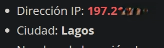
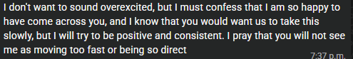
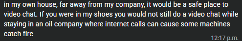
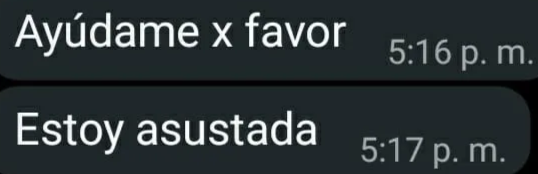
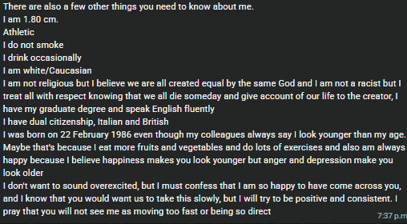
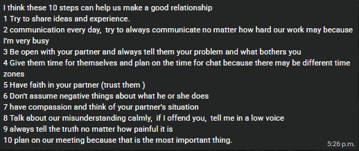
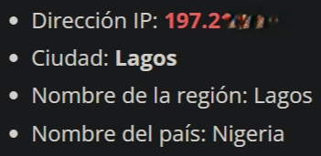
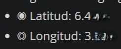
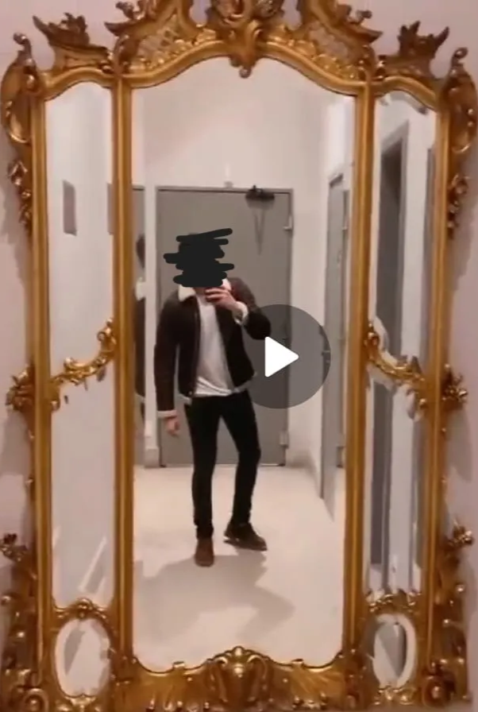
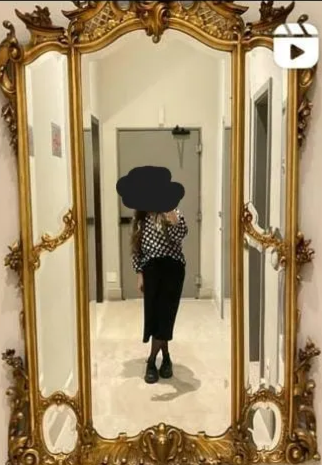

# Análisis OSINT de posible scam romántico en app de citas y contención de riesgo para víctima

### 

### Resumen ejecutivo

Se analizó un perfil conocido mediante una app de citas que presentaba inconsistencias de identidad, ubicación y comportamiento. La investigación incluyó revisión  de imágenes, análisis de metadatos contextuales, validación de ubicación aproximada, correlación de perfiles y acompañamiento preventivo ante posible sextorsión. Se emitieron recomendaciones de contención, privacidad y monitoreo de exposición digital.

---

### Contexto inicial

La victima conoció al perfil en Bumble, el cual género confianza en la víctima por la forma en la que se expresaba (muy educada, según refiere), además de compartir fotos y videos. Rápidamente intercambiaron números telefónicos y redes sociales privadas. Conforme pasaban los días, la víctima comenzaba a compartir su día a día: enviar fotos de ella, fotos de su hija, ubicación real, redes sociales de algunos amigos, trabajo, hasta llegar a fotos íntimas

Después de aproximadamente cinco días la victima empezó a notar inconsistencias, y cuando increpo al individuo, éste respondió de forma agresiva y amenazando con difundir las fotos e información compartidos.

---

### Objetivo de la investigación

* Verificar si el perfil era auténtico.
* Identificar inconsistencias entre identidad, ubicación y narrativa.
* Reducir riesgo para la víctima.
* Preservar evidencia.
* Recomendar acciones de seguridad digital.

---

### Alcance

La investigación se realizó únicamente con información proporcionada por la víctima y fuentes abiertas. No se accedió a cuentas privadas, sistemas, dispositivos ni información protegida.

---

### Diagrama de Investigación

Número UK
|
WhatsApp
|
Perfil Bumble
|
Fotos
|
Espejo Dorado
|
Instagram
|
Londres

Canary Token
|
IP
|
Lagos
|
Nigeria

---

### Metodología

#### **Fase 1: Recolección inicial**

* Número telefónico: +44 7777 ******
* Narrativa: Al principio generó confianza; posteriormente se volvió confusa, contradictoria o ilógica
* Datos declarados:

  * Nombre: Giovanni X
  * Ocupación: Ingeniero Petrolero
  * Nacionalidad: Inglés (Reino Unido)
  * Ubicación: Londres. Refiere que trabaja en una plataforma marítima
  * Explica que por temas de seguridad en su trabajo, supuestamente no le es posible usar el celular y mucho menos las cámaras

#### **Fase 2: Validación visual**

* Se realizó una inspección visual detallada de los fotos y videos compartidos por el victimario en busca de patrones, objetos únicos y elementos diferenciadores del entorno
* Una vez teniendo los objetos más relevantes, se procedió con la búsqueda inversa de imágenes:

  * Puertas
  * Decoración
  * Rasgos faciales
  * Espejo dorado

#### **Fase 3: Análisis de identidad y ubicación**

* Se revisó la lada del número telefónico y era consistente con su supuesta ubicación
* El video donde aparece el espejo dorado pudo correlacionarse con la publicación de una fémina en Instagram, donde ciertamente indica que se ubica en Londres
* Las imágenes asociadas muestran a un hombre adulto de apariencia pulcra y fotos de buena calidad.
* Se observó consistencia facial entre las distintas fotos proporcionadas, sugiriendo que corresponden a la misma persona
* Las imágenes carecen de elementos verificables que permitan confirmar ubicación geográfica, nacionalidad o identidad real
* Por tal motivo, las fotografías fueron utilizadas como apoyo para correlación visual y no como evidencia concluyente de identidad
* Se usaron identificadores de IP para obtener una lugar aproximado a la ubicación en tiempo real. La evidencia muestra inconsistencias con la ubicación declarada

#### **Fase 4: Evaluación de riesgo**

* Amenazas del victimario sobre difundir las fotos intimas de la víctima si no se le daba un pago
* El perfil también amenazó con contactar a familiares y amigos de la víctima
* Riesgo de robar las cuentas de redes sociales de la víctima

#### **Fase 5: Contención**

* Revisión de privacidad como verificación de contraseñas sólidas
* Bloqueo y restricción de perfiles
* Preservación de evidencia aún disponible
* Monitoreo constante de exposición pública durante un veinte días

---

### **Línea de tiempo**

|Fecha|Evento|
|-|-|
|Día 1|La víctima reporta inconsistencias|
|Día 1|Se recopilan capturas y datos iniciales|
|Día 2|Se identifica inconsistencia de ubicación|
|Día 2|Se emiten recomendaciones de contención|
|Días posteriores|Monitoreo de posible exposición|

---

### Indicadores

* Indicador 1 - Confianza: Alto. Inconsistencia de ubicación: El perfil declaró estar en un país/ciudad, pero ciertos indicadores técnicos/contextuales apuntaban a otra región.

* Indicador 2 - Confianza: Alto. Patrón compatible con scam romántico/sextorsión: Love bombing, evasión de videollamada, contradicciones, urgencia emocional y posterior amenaza

* Indicador 3 - Confianza: Alta. Negativa persistente a videollamadas. El individuo da explicaciones confusas, incompletas, incoherentes e ilógicas del porqué no le es posible hacer uso de las cámaras del celular

* Indicador 4 - Confianza.: Alto. Uso de material visual posiblemente reutilizado: Las imágenes contenían elementos difíciles de atribuir directamente al perfil, como el espejo dorado y espacios asociados a terceros.

* Indicador 5 - Confianza: Muy Alto. Riesgo para la víctima: Existía posible riesgo de exposición de fotos íntimas personales y contacto con redes sociales

---

### Matriz de confianza

|Indicador|Nivel|
|-|-|
|Número UK|Alto|
|Fotos|Medio|
|Espejo|Medio|
|IP Lagos|Alto|
|Narrativa scam|Alto|
|Amenaza posterior|Muy alto|

---

### Contención

Debido al riesgo percibido de exposición de información personal, se implementó monitoreo preventivo de posibles filtraciones.

---

### Conclusión

La suma de los indicadores obtenidos incrementa significativamente la probabilidad de fraude

---

### Limitaciones

* No se verificó identidad mediante videollamada
* No se obtuvo documento oficial
* No se tuvo acceso al dispositivo del investigado
* Las fotografías pueden haber sido reutilizadas por terceros
* La ubicación obtenida representa únicamente una evidencia contextual
* 

---

### 

### Resultado

Se redujo el riesgo inmediato mediante bloqueo, restricción de perfiles, preservación de evidencia y monitoreo. No se identificó exposición pública durante el periodo revisado. La víctima recibió una guía de acciones preventivas y canales de denuncia.

---

### 

### Anexos

* Anexo 1. Narrativa típica de scammers y fraude romántico

* Anexo 2. Verificación aproximada de dirección IP mediante Canary Token

* Anexo 3. Pivoting y correlación con una publicación en el mismo lugar

---

### Herramientas empleadas

* Google Dorks
* Reverse Image Search
* Canary Tokens
* Instagram
* WhatsApp
* Navegador Web
* Análisis manual de imágenes
* Pivoting
* OSINT manual

---

### Evaluación final

|Factor|Resultado|
|-|-|
|Identidad verificable|No|
|Ubicación verificable|No|
|Videollamada|No|
|Consistencia narrativa|Baja|
|Riesgo de sextorsión|Alto|
|Riesgo de fraude|Alto|

---

